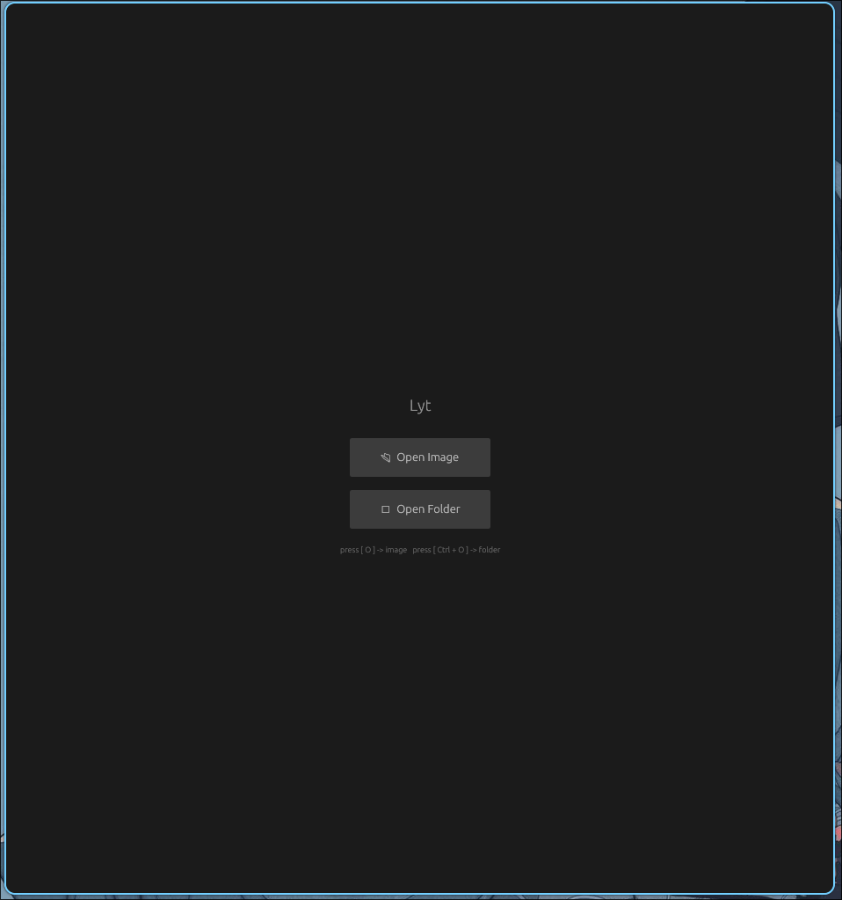
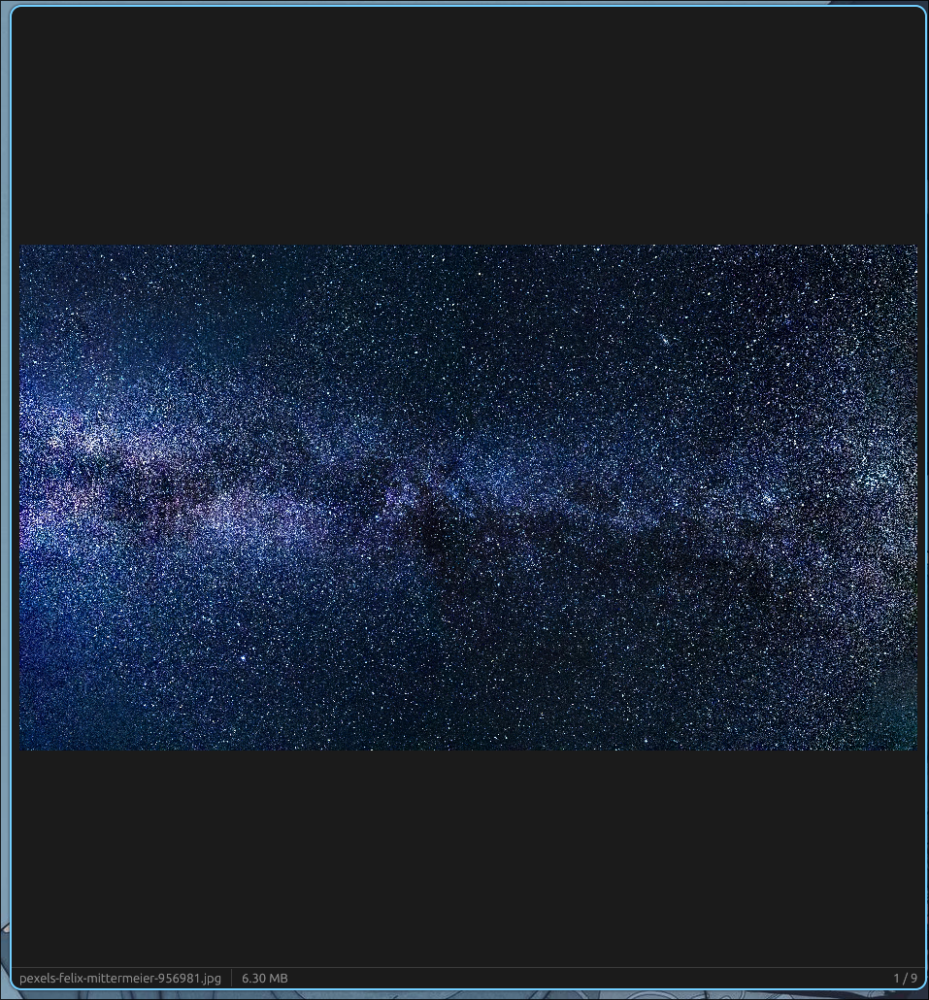

# Lyt

A lightweight image viewer written in Rust using the Egui library.

## Screenshots

  
  

⚠️ **Status: Early Development**

Current version: **v0.0.1**

This project is currently in an early development stage.
Features are incomplete.

---

# About

Lyt is a minimal and fast image viewer designed to experiment with building GUI applications in Rust.

The goal of this project is to build a simple but efficient image viewer with minimal dependencies and good performance.

---

# Features

### Current

* Open and display images
* Basic viewer mode
* Zoom and pan

### Planned

* Directory browsing
* Animated image support (GIF, etc.)
* Keyboard navigation
* Image metadata display
* Highly customizable

---

# Project Status

Version **0.0.1**

This is an experimental version intended for development and testing.

Things may:

* break
* change
* be incomplete
* be unstable

---

## License

This project does not currently have a license.
A license will be added in a future version.
